# OANA System Diagrams

This document contains all system diagrams for the OANA (Offline AI Note Assistant) project in Mermaid markdown format.

## 1. Data Flow Diagram

Shows how data flows through the OANA system from user input to output.

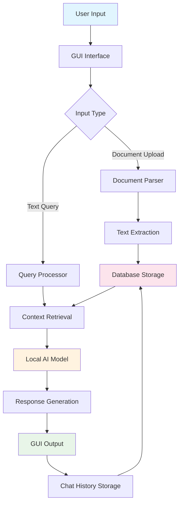

## 2. System Architecture Diagram

High-level view of OANA's system architecture and components.

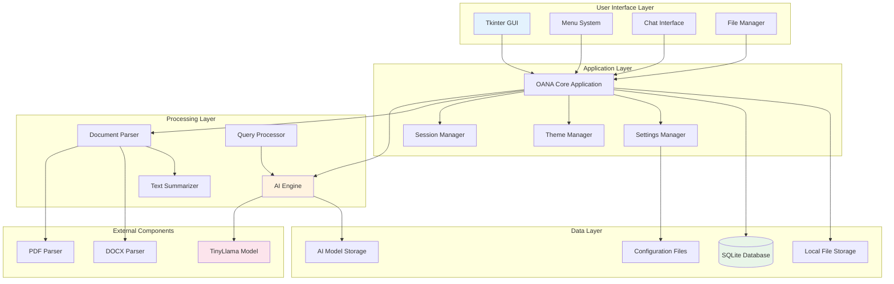

## 3. Activity Diagram - Document Processing

Shows the workflow for processing documents in OANA.

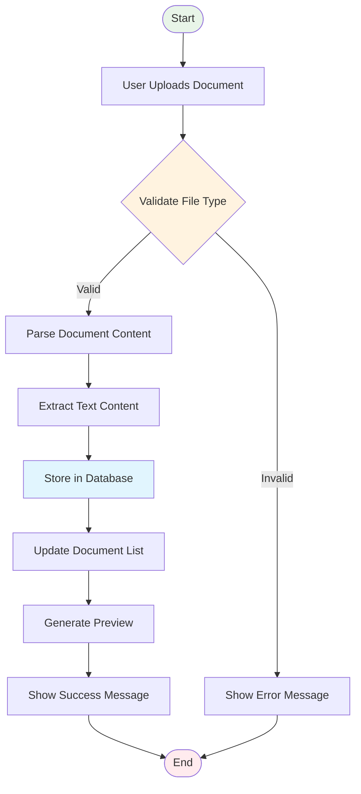

## 4. Activity Diagram - AI Query Processing

Shows the workflow for processing AI queries.

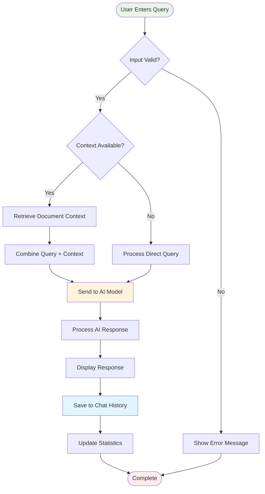

## 5. Use Case Diagram

Shows all use cases and actors in the OANA system.

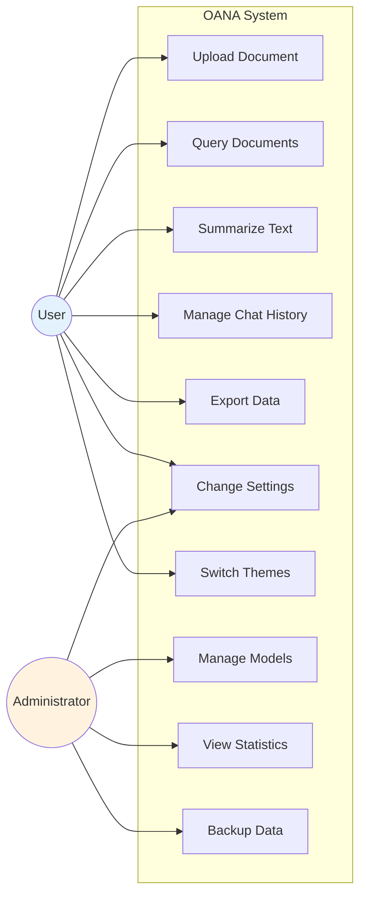

## 6. Class Diagram

Shows the main classes and their relationships in OANA.

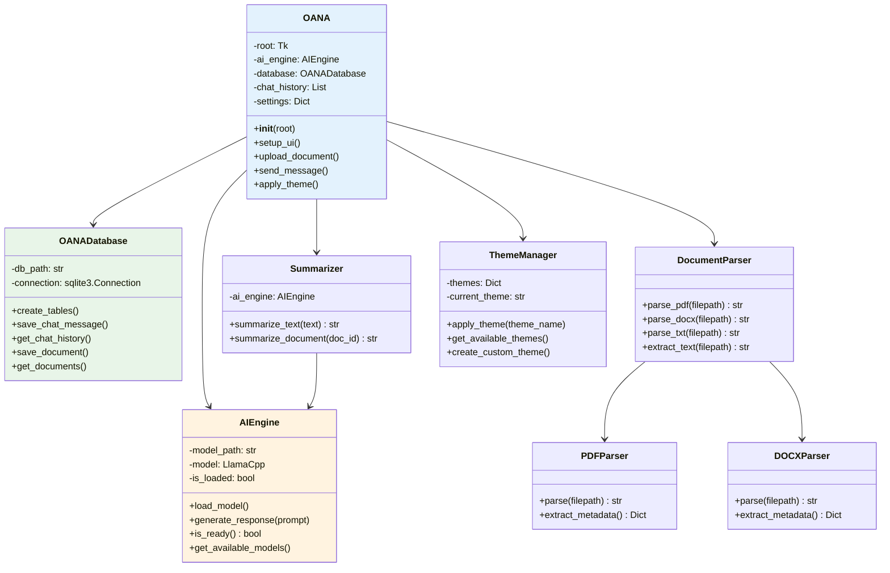

## 7. Entity Relationship Diagram

Shows the database schema and relationships.

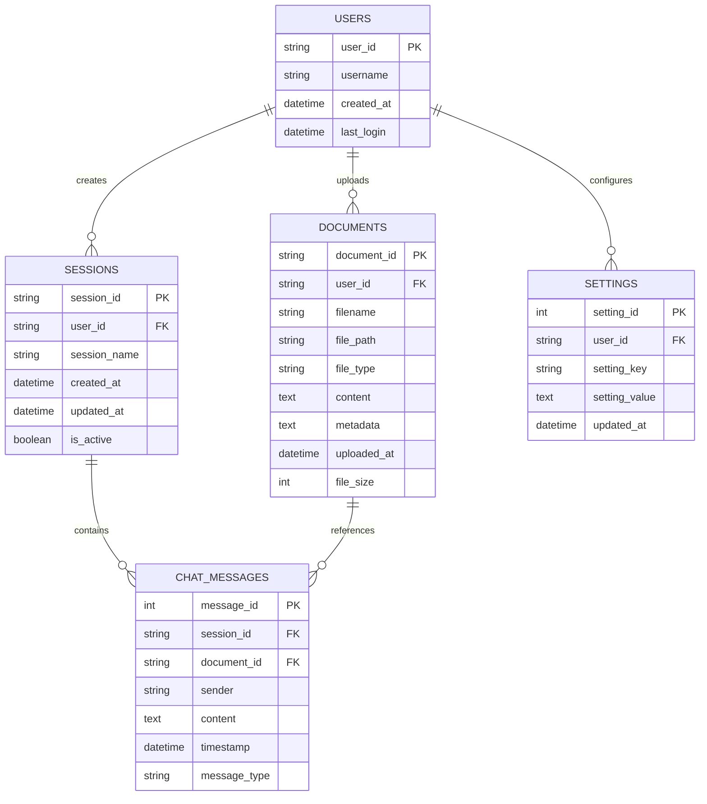

## 8. Sequence Diagram - Document Upload Process

Shows the sequence of interactions during document upload.

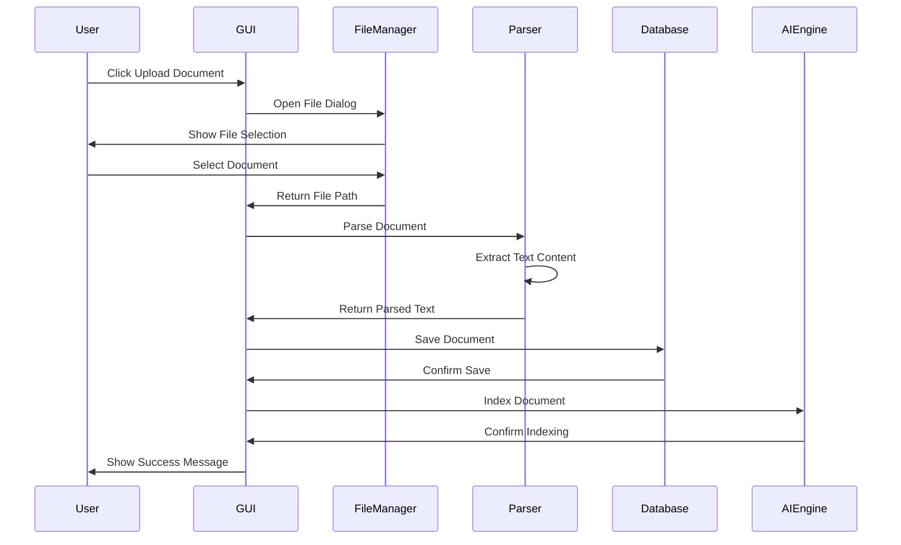

## 9. Sequence Diagram - AI Query Process

Shows the sequence of interactions during AI query processing.

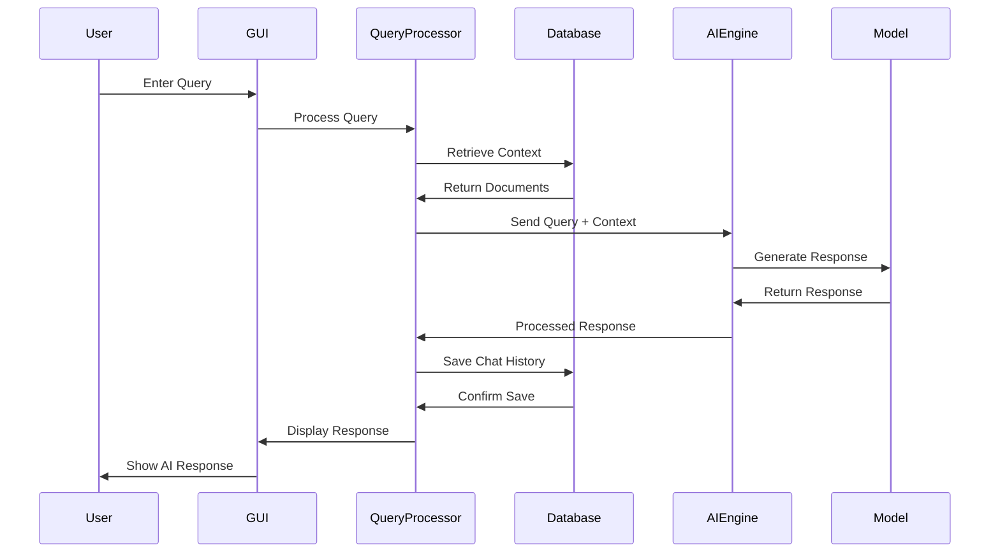

## 10. Component Diagram

Shows the high-level components and their dependencies.

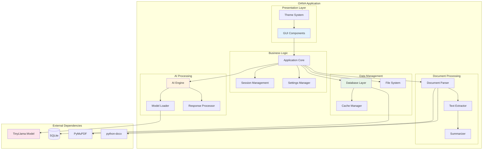

## 11. State Diagram - Application State

Shows the different states of the OANA application.

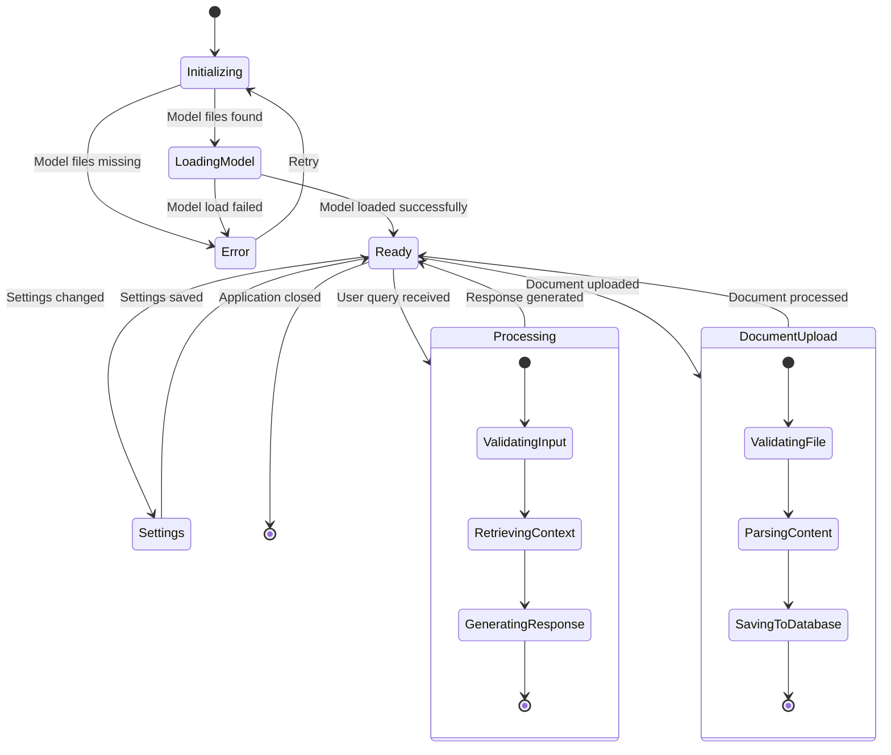

## 12. Deployment Diagram

Shows the deployment architecture of OANA.

```mermaid
flowchart TB
    subgraph "User's Computer"
        subgraph "OANA Application"
            Executable[OANA.exe]
            Models[AI Models]
            Database[(Local Database)]
            Config[Configuration Files]
            Logs[Log Files]
        end
        
        subgraph "System Dependencies"
            Python[Python Runtime]
            Libraries[Required Libraries]
            OS[Operating System]
        end
    end
    
    subgraph "Optional External"
        GitHub[GitHub Repository]
        Updates[Update Server]
    end
    
    Executable --> Models
    Executable --> Database
    Executable --> Config
    Executable --> Logs
    Executable --> Python
    Python --> Libraries
    Libraries --> OS
    
    Executable -.-> GitHub : Source Code
    Executable -.-> Updates : Version Check
    
    style Executable fill:#e3f2fd
    style Models fill:#fff3e0
    style Database fill:#e8f5e8
    style GitHub fill:#f3e5f5
```

---

**Note**: All diagrams use Mermaid syntax and can be rendered in any Markdown viewer that supports Mermaid, such as:
- GitHub
- GitLab
- Notion
- VS Code with Mermaid extension
- Mermaid Live Editor (https://mermaid.live)

To view these diagrams properly, copy the markdown content to any of these platforms or use a local Markdown editor with Mermaid support.